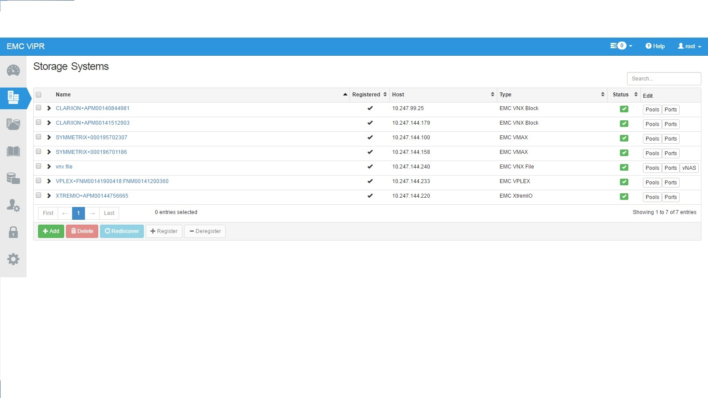
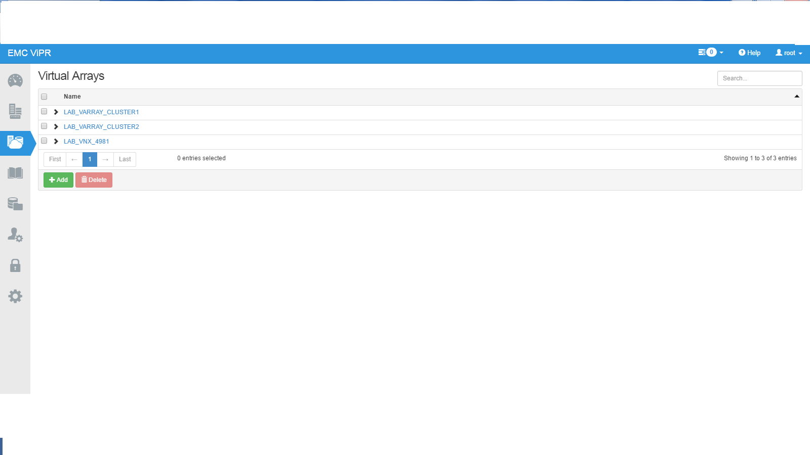
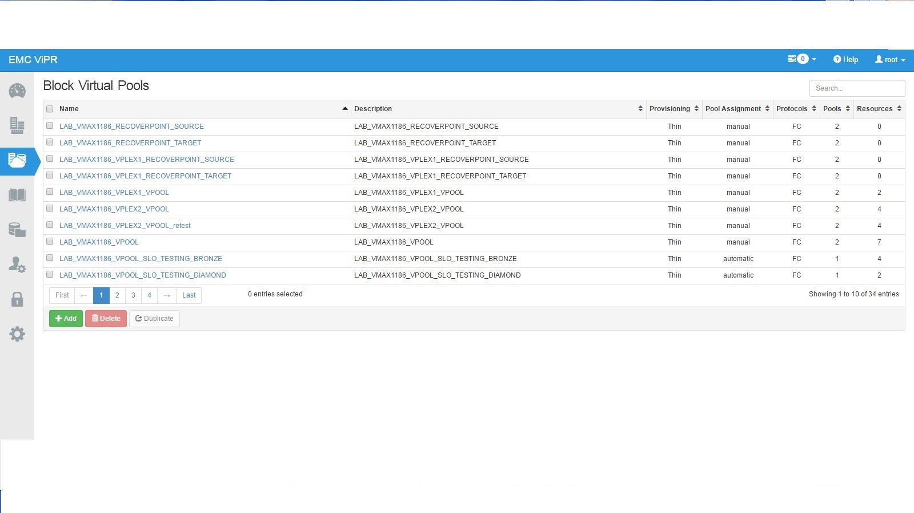
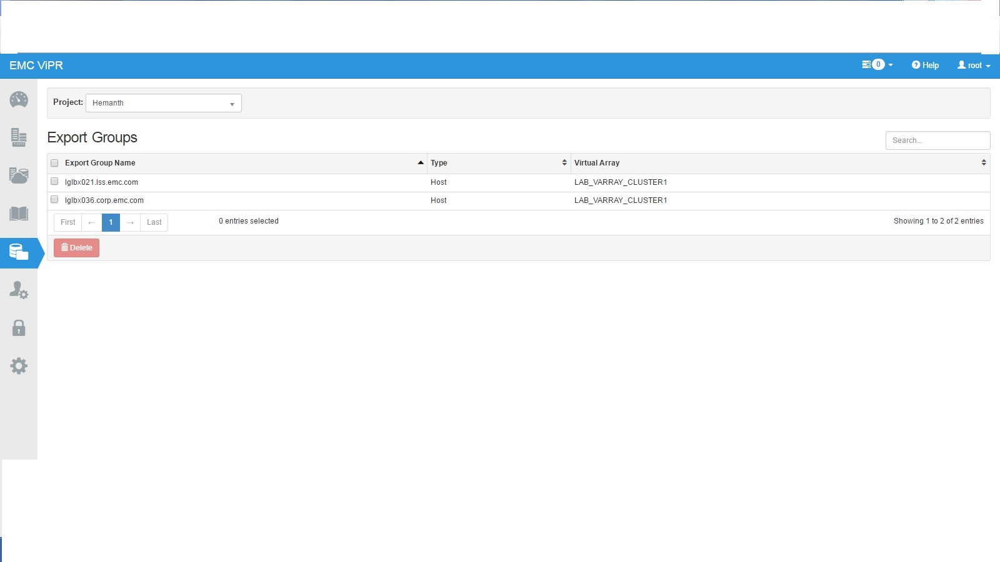

COPRHD Flocker Plugin
======================
The plugin for COPRHD Flocker integration.

## Description
ClusterHQ/Flocker provides an efficient and easy way to connect persistent store with Docker containers. This project provides a plugin to provision resillient storage from COPRHD.

## COPRHD Flocker Intergration Block Diagram


Tested the coprHD
1.	 Ubuntu – 14.04.03 – LTS 
2.	Flocker – 1.10.2
3.	Docker – 1.10.1 - build 9e83765
4.	2 Node setup


Pre-requsities
---------------
1. Install CoprHD - Vipr 

	a. Verify the Storage arrays recognized . After login to the Vipr we can check the storage systems
Below is a sample screenshot

	
    
       b. Configure Virtual array 

	

      c. Configure Virtual Pools - In Virtual pools policies are configured 

	


2. Install scsi tools

sudo apt-get update
sudo apt-get install -y open-iscsi
sudo apt-get install -y lsscsi
sudo apt-get -y install scsitools

3. Install ClusterHQ/Flocker
Refer to ubuntu install notes -> https://docs.clusterhq.com/en/0.4.0/

4. Install EMC Plugin 

git clone https://github.com/emccode/flocker-drivers
cd copr-hd
sudo /opt/flocker/bin/python setup.py install

5. Install vipr-cli 2.4 or above

Refer the below link for more information
http://www.emc.com/collateral/TechnicalDocument/docu62079.pdf

## Usage Instructions
To start the plugin on a node, a configuration file must exist on the node at /etc/flocker/agent.yml.
```bash
control-service: {hostname: ${ipaddress}, port: ${port}}
dataset: {backend: coprhd_flocker_plugin}
version: 1
dataset:
    backend: coprhd_flocker_plugin
    xms_ip: ${xms_ip}
    xms_user: ${xms_user}
    xms_password: ${xms_password}
    coprhd_hostname: ${coprhd_hostname}
    coprhd_port: ${coprhd_port}
    coprhd_username: ${coprhd_username}
    coprhd_password: ${coprhd_password}
    coprhd_tenant: ${coprhd_tenant}
    coprhd_project: ${coprhd_project}
    coprhd_varray: ${coprhd_varray}
    coprhd_cookiedir: ${coprhd_cookiedir}
    volume_backend_name: ${volume_backend_name}
    coprhd_vpool: ${coprhd_vpool}
```
A sample vagrant environment help 
Please refer to ClusterHQ/Flocker documentation for usage. A sample deployment and application can be found at to be updated


The below test case have been tested 

1. Using docker start a application and provision a volume on demand
2. Using docker move a application from one node to another node with persistent storage 

Docker commands are below 

docker run -v <volume-name>:/data --volume-driver=<driver-name> -ti busybox sh

Debug: 

	The log files are /var/log/flocker  

When docker starts host will get created on Vipr 



In Vipr when storage is getting provisioned the same will get refrected in the vipr Dashboard in the task list

## Future
- Add Chap protocol support for iSCSI
- Add 

10. Generating & using security file
=========================================
pre-requisites easy_install pycrypto

* use the file encrypt_password.py in util folder to generate a
  security file, which has the username and password in an encrypted form.

* Usage of encrypt_password.py:
```
   python encrypt_password.py -user <vipruser> -password <viprpassword>
            -securityfile <complete filepath where encrypted security is stored>
               -flockeruser <User account which runs the root service>
```
* The security file generation can be done in two ways
   1. The admin can login as root user and then run the above command to
      generate a security file at a location, which is accessible to only
      "root" user account.

                        OR

   2. Login as the root user and then open /etc/passwd and then go to the
      entry named root.

      Change the last entry from /sbin/nologin to /bin/bash and you will 
      be able to run commands through the account "root"

      Make sure that the encrypt_password.py is placed in a location, which
      has permission for root user and run the below command and run the
      below command

      ```
       su -l root -c "python <appropriatefolder>/encrypt_password.py 
                              -user <vipruser> -password <viprpassword> 
            -securityfile <filepath_where_encrypted_security_is_stored> 
               -coprhduser <User_account_which_runs_the_coprhd_service>"
      ```
* open /etc/flocker/agent.yml and make following changes
   ```
   coprhd_security_file=<filepath_where_encrypted_security_is_stored>
   ```
   
  If the vipr_security_file entry is not specified or is empty,
  then the regular username and password fields will be used.


